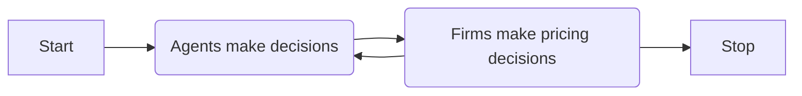

# Master thesis 

*Date:* 2025-12-05

## Information

*Subject:* 

*Language:* English

*Programming language:* R

## The agent-based simulation

### General setting

The time $t \in \mathbb{N}$ is discrete. The following diagram shows the main loop of the simulation. 

### What is the "good"

The good is described in the following way

- price: $p \in \mathbb{R}_{+}$
- other descrete features, e.g., a display with built-in camera or without one
- other continous features, e.g., size, intensity of something

### Model of an agent

*General setting*

There is a population of agents. Every consumer is making a buying decisions. Based on the buying decisions, the consumer collectively create demand. The only thing to decide here is how consumers make their decisions.

*How do we model consumer decisions?*

Description of the consumer:

- reservation price
- the perfect features of the good in question.

Description of the buying algorithm for a consumer (this is only an example):

- Select a product at random from the products that you have not viewed recently.
- Calculate the distance between the product and the perfect match.
- Decide if you buy the product. ➡️ Here we can have a simple algorithm, for example, there is a function that maps the distance between the product and the perfect match to probabilities. However, we can think about something more sophisticated.
- You bought the product. This is the end.
- If you didn't buy the product, decide if you want to look for another one.
- If you don't want to look for another one, this is the end.
- If you want to look for another one, go to the first step.

### Model of a firm

*General considerations.*

1. The goal of the firm is to maximize the profits. The question is, does it maximize the profit in the short run, meaning one step, or in the long run, meaning going to infinity? These two approaches will be completely different, and the second one is going to be way more difficult than the first one.

2. What is the information that the firm has at the time of making decisions? Is it only the pricing and the demand for this particular firm? Or is it all prices in the market? Or is it all demands in the market? Also, is it the whole time series from the beginning of the simulation or is it only the last step?

3. Based on the information that the firm has and the goal of the firm, what is the proper algorithm of making a decision? Also, the question is what is the decision? Is it only the pricing decision or is it also the production decision? For example, I'm going to produce a different good with these different features and then going to price it differently.

*Example*

1. There is a population of agents. Each agent is characterized by reservation price and a perfect match in terms of goods features. 

1. The buying algorithm for an agent is the following. The agent looks at two offers provided by two firms. These offers are two goods with two potentially different prices and every good has a fixed quality in terms of features. An agent calculates the difference between the perfect fit and the good and the reservation price.If the price is below reservation price, the agent stochastically buys the product, where the probability of buying the product depends on how different the product is from the perfect fit.

1. There are only two firms.

1. Each firm is described in terms of cost function.

1. Each firm is producing a fixed good, meaning the features of the good are fixed.

1. The only decisions that firms are making are about prices.

1. Information that a firm has at the time of making a decision is private and this information is only the profit from the two previous steps and prices.

1. Pricing algorithm.

   - If the profit were increasing and the prices were increasing, in the next step the firm is going to increase the prices again.
   - If the profit were increasing and the prices were decreasing, in the next step the firm is going to decrease the prices again.
   - If the profit was decreasing and the prices were increasing, in the next step the firm is going to decrease the prices.
   - If the profit was increasing and the prices were decreasing, in the next step the firm is going to increase the prices.

## TODO

1. Write the above simulation and run it. See if there are any problems. Does it converge? What is an average path of the simulation?