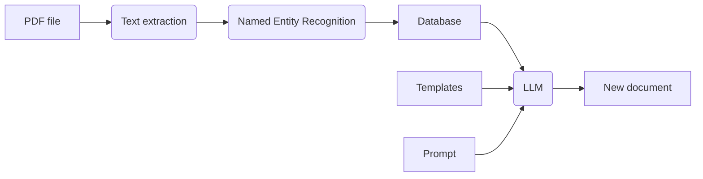

# Master thesis on the topic of "Development of an intelligent system of document processing and generation based on machine learning methods"

In the scope of this thesis we will conduct research on Natural Language Processing and develop an intelligent system that allows us to automatically process text and scanned documents, extract key data from them and form new documents based on them. 

At the first stage, the input documents undergo **OCR (Optical Character Recognition)**, after which the model uses **Named Entity Recognition algorithms** to extract and structure the necessary information. The resulting data is then stored in a **PostgreSQL database**, which provides a “memory” of current documents and already generated documents. Finally, based on templates and **Generative Models (mainly Transformer family)** of neural networks, the model generates new documents, taking into account the information already entered.

The purpose of implementing this platform is the detailed study of the work of machine and deep learning algorithms in more detail, potentially reduce manual labor, minimize the risk of errors when working with documents, and be scalable to solve a wide range of tasks in the field of electronic document management.

